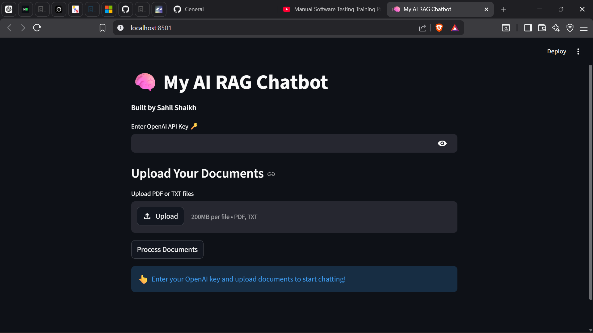

# 🧠 My AI RAG Chatbot

**Developed by: Sahil Shaikh**

A smart **Retrieval Augmented Generation (RAG)** based AI chatbot that can answer questions from your uploaded PDF and Text documents.

## Features
- Upload multiple PDF/Text files
- Intelligent context-aware answers
- Conversation memory
- Clean and user-friendly Streamlit interface


## Tech Stack
- Python
- LlamaIndex
- OpenAI GPT-3.5-turbo
- Chroma Vector Database
- Streamlit

## About Me
- **Name**: Sahil Shaikh
- **College**: Sinhgad College of Engineering 
- **Location**: Pune , Maharashtra
## How to Use

1. Enter your **OpenAI API Key**
2. Upload your PDF or TXT documents
3. Click on **"Process Documents"** button
4. Once processed, start asking questions about your documents
5. Chat with the AI — it will answer based on your uploaded files only

## How to Run Locally

```bash
# Clone the repo
git clone https://github.com/Sahil-SCOE/my-ai-rag-chatbot.git
cd my-ai-rag-chatbot

# Install dependencies
pip install -r requirements.txt

# Run the app
streamlit run app.py


## Connect With Me
- GitHub: [@Sahil-SCOE](https://github.com/Sahil-SCOE)

---

**Made with ❤️ by Sahil Shaikh**  
*Built as a Portfolio Project in 2026*